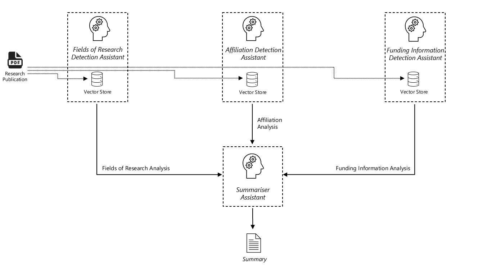

# Research Publication Analysis

This sample code demonstrates the use of a multi-agent pattern to analyse research publications. The pattern makes use of agents specialised in interpreting specific areas such as the fields of research, affiliation to universities and information on research grants & funding.

The solution is based on the multi-agent framework as described here - https://techcommunity.microsoft.com/t5/ai-azure-ai-services-blog/building-a-multimodal-multi-agent-framework-with-azure-openai/ba-p/4084007

## Instructions For Use

1. Update .env file with API endpoint, key, API version and deployment name for the chosen deployment in your Azure OpenAI service 
2. In the researchpubanalysis python notebook, replace #university# with the name of your university
3. Next, replace #misspeltuninames# with typical spelling mistakes made in publications with the university's name. Use double quotes for each spelling and separate them using a comma. For e.g. if Great Barrier University is sometimes misspelt as Grt Barrier or Great Barier, replace #misspeltuninames# with "Grt Barrier", "Great Barier"
4. Follow the instructions in the python notebook to execute the pattern. The default prompts are provided but can be updated if required. Add the file path for the research publication as per the instructions provided when creating the vector store.
5. Each agent will provide an output specific to one of the three areas, i.e. fields of research, affilitation to the university and information on research grants & funding.
6. The final output will be a summary containing all three areas.

## Sample Output

### Field of Research (FOR) Detection

Based on the analysis of the provided research paper, the primary field of research is "Commerce Management Tourism and Services" with a focus on tourism management and consumer behavior in booking decisions. The secondary field within the same category is "Marketing" as the study involves framing effects and promotional strategies to influence booking behavior.

Here are the research codes and the reasons for picking them:

1. **3508 - Tourism**
   - The research paper primarily investigates tourists' temporal booking decisions and the effect of contextual framing on these decisions. It explores how different framing approaches (risky choice framing and attribute framing) influence the timing of tourists' booking choices, which is directly related to tourism management.

2. **3506 - Marketing**
   - The study also delves into marketing communication strategies and how tourism marketers can use framing to encourage early bookings. It discusses the practical significance of message framing in promotional programs and marketing campaigns aimed at influencing consumer behavior in the tourism industry.

These codes accurately reflect the primary and secondary research fields covered in the paper.

### Affiliation Detection

The research paper mentions Great Barrier University multiple times, specifically in the author affiliations. Here are the details:

1. **Author One**
   - Organisation: Great Barrier Business School, Department of Management and Marketing, College of Arts, Social Sciences and Commerce, Great Barrier University.

2. **Author Two**
   - Organisation: Great Barrier Business School, Department of Management and Marketing, College of Arts, Social Sciences and Commerce, Great Barrier University.

3. **Author Three**
   - Organisation: Great Barrier Business School, Department of Management and Marketing, College of Arts, Social Sciences and Commerce, Great Barrier University.

All three authors are affiliated with Great Barrier University, specifically with the Great Barrier Business School, Department of Management and Marketing, College of Arts, Social Sciences and Commerce.

### Funding & Research Grants Detection

The research paper does not explicitly mention any funding bodies or grant numbers. The paper primarily focuses on the research conducted by Dr. Author One as part of his doctoral dissertation, with significant advice and guidance provided by Professor Author Two and Associate Professor Author Three in their roles as principal and co-supervisors, respectively. There is no specific section or acknowledgment that details funding sources or grant numbers related to the research.

### Summary Report

#### Research Field Analysis
The primary field of research for the paper is "Commerce Management Tourism and Services," with a specific focus on tourism management and consumer behavior in booking decisions. The secondary field within the same category is "Marketing," as the study involves framing effects and promotional strategies to influence booking behavior. The research codes identified are:
1. **3508 - Tourism**: The study investigates tourists' temporal booking decisions and the effect of contextual framing on these decisions.
2. **3506 - Marketing**: The study explores marketing communication strategies and how tourism marketers can use framing to encourage early bookings.

#### Affiliation Analysis
All three authors of the paper are affiliated with Great Barrier University, specifically with the Great Barrier Business School, Department of Management and Marketing, College of Arts, Social Sciences and Commerce. The authors are:
1. **Author One**
2. **Author Two**
3. **Author Three**

#### Funding Analysis
The research paper does not explicitly mention any funding bodies or grant numbers. The research was conducted as part of Dr. Author One's doctoral dissertation, with significant guidance from Professor Author Two and Associate Professor Author Three. There is no specific acknowledgment of funding sources or grants related to the research.

This summary captures the findings from the analysis conducted by the three assistants, focusing on the research field, author affiliations, and funding information.